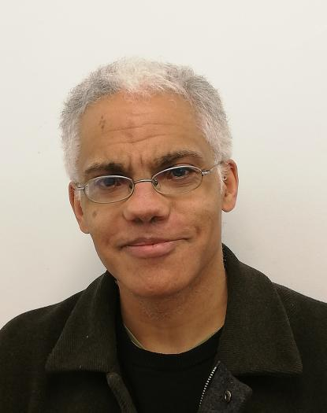

## Workshop On Reachability, Recurrences, and Loops
### Satellite Workshop at [ICALP 2023](https://icalp2023.cs.upb.de/)
#### Paderborn, Germany
#### Monday 10th July 2023

---

## Topic

 

Recursively defined sequences are foundational objects of study in the computational sciences; they arise naturally in areas such as: the analysis of algorithms, weighted automata, loop termination, and probabilistic models. 

---

## Aim

 

The aim of WORReLL'23 is to bring together researchers from the community and showcase cutting-edge research on the above topics.
The one-day workshop will also celebrate the research contributions of Professor James Worrell (also known as Ben). For context, Ben is giving an [invited talk](https://icalp2023.cs.upb.de/invited-speakers/) at ICALP this year.

 

Coincidentally, the workshop is a few days prior to Ben's birthday.
We are also planning to organise a birthday dinner as the closing event of the workshop, so please take this into consideration for planning your travel to Paderborn.

---

## Schedule

 

To be announced

---

## Organisers

 

[George Kenison](https://georgekenison.github.io/) (TU Wien, Austria) and [Mahsa Shirmohammadi](https://www.irif.fr/~mahsa/) (CNRS, Paris)

